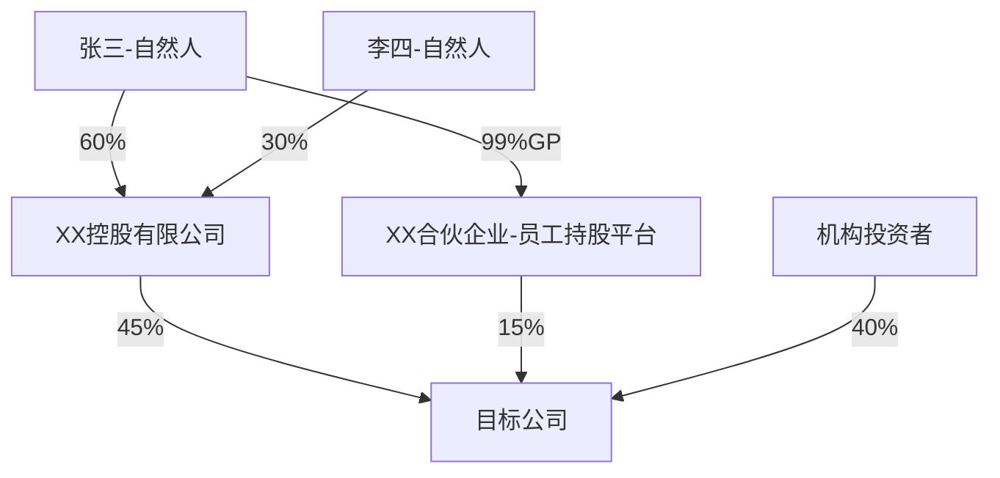

# 股权穿透图及关联方分析(Equity Penetration Analysis)

## 目标角色 (Target Role)

- **角色**:对公客户经理、信贷审批官、风险经理
- **使用场景**:贷前股权尽调、集团授信穿透、股权质押贷款、IPO/重组前尽调、贷后风险排查
- **输出用途**:生成结构化股权穿透及关联方分析报告,为授信决策和风险评估提供股权与控制权维度的专业支持
- **决策层级**:信贷审批核心参考材料,风险等级 high,需信贷审批官复核
- **执行频率**:每次授信申请前执行一次,贷后风险排查按需执行

## 数据接入 (Data Sources)

### 必需数据
| 数据项 | 来源 | 获取方式 | 敏感级别 |
|--------|------|---------|----------|
| 工商登记信息 | 国家企业信用信息公示系统/天眼查/企查查 | API/爬虫 | 公开 |
| 企业年报/招股说明书 | 证监会/交易所公告 | 文件读取 | 公开 |
| 征信系统记录 | 人行征信/法院被执行人名单 | API | 内部/敏感 |
| 行内关联交易记录 | 行内关联交易登记系统 | API | 机密 |
| 历史尽调报告 | 影像档案系统 | 文件读取 | 内部 |

### 数据脱敏规则
- 实际控制人身份证号:显示前3后4,中间用 * 替代
- 银行账号:仅显示后4位
- 关联方联系方式:不在输出中出现
- 客户敏感财务数据(如关联交易金额):仅在内部报告中使用,不得外传
- 隐性关联方信息:仅在内部记录中标注,不对外披露

### 降级策略
- 如果征信系统不可用:标注"征信数据未核验",基于工商信息继续分析
- 如果行内关联交易记录不可用:标注"行内关联交易数据未纳入",基于公开信息识别关联方
- 如果历史尽调报告不可用:标注"无历史尽调参考",从头开始分析
- 如果工商数据仅有1年:标注"数据不足,股权变更时间线不完整",仅做静态分析
- 如果商业数据库超时:使用国家企业信用信息公示系统(免费但较慢),并明确标注数据来源

---

## 约束条件 (Constraints)

> 监管依据:《公司法》第216条关联方定义、《商业银行法》第40条关联交易管控、
> 银监会《商业银行与内部人和股东关联交易管理办法》、证监会《上市公司信息披露管理办法》

1. **穿透完整性**:穿透须至自然人或国资委等终极控制人,中途不得以"公众公司"为由截止(上市公司公众持股部分除外)
2. **多源交叉验证**:关联方认定须来自两个以上独立信息源,单一商业数据库不得作为唯一依据
3. **动态时间线**:股权变更分析必须覆盖近3年,重大事项(融资/IPO/重组)前后的变更需标注动机
4. **不确定性显式标注**:信息缺失或存疑的关联关系,须以"疑似/待核实"标注,禁止直接定性
5. **利益输送量化**:关联交易异常须给出具体偏离量(如"定价较市场价偏高37%"),禁止仅凭定性描述下结论
6. **数据可溯源性**:所有结论须明确标注数据来源(工商登记/年报/征信系统/尽调报告),引用具体页码或科目
7. **信贷视角聚焦**:风险评估须结合贷款申请金额与企业净资产比例,输出授信决策参考依据
8. **禁止跳过步骤**:必须按步骤0→1→2→...→9顺序执行,不得跳过股权穿透、实控人认定、关联方识别等核心步骤
9. **红线执行强制**:如触发任何红线(R1-R6),必须在报告开头显著标注,并建议暂缓授信

### 金融合规红线

**R1:实际控制人逃废债** - 实际控制人或关联方存在未结清逃废债、拒执记录,必须暂停授信,待核实后再行评估

**R2:融资平台无实质经营** - 企业为集团融资平台,自身无实质性经营资产(营收结构、固定资产占比、员工社保人数异常),必须暂停授信

**R3:股权代持超限** - 股权代持比例 > 30%,且无合理解释,必须标注高风险,要求提供代持协议及法律效力证明

**R4:关联方资金占用** - 关联方占用资金未归还,金额 > 净资产 20%,必须暂停授信,要求提供还款计划

**R5:实控人资产转移** - 实际控制人在申请前12个月内大幅减持/转让核心资产,必须标注高风险,核实资金去向

**R6:未披露重大担保** - 存在未披露的重大对外担保,且担保金额超过净资产 50%,必须暂停授信,要求提供担保合同及风险评估

**触发任一红线条件,须在报告摘要中显著标注,并建议暂缓授信决策。**

---

## 分析原则 (Analysis Principles)

- **穿透看实质**:不被表面的法律主体和持股比例迷惑,追溯至真实利益归属
- **控制权优先**:关注实际控制力而非仅看持股比例,重视协议控制、一致行动等安排
- **利益链追踪**:关注资金流向和利益分配路径,识别异常利益输送
- **合规审视**:以监管视角审视股权安排的合规性和信息披露充分性
- **动态分析**:关注股权变更的时间线和动机,而非仅看静态结构
- **完整拼图**:将碎片化信息拼接为完整的股权关系网络

## 信贷场景专属关注点

> 本技能面向贷前尽调、授信审批、贷后管理场景,以下维度在信贷评估中具有特殊优先级:

| 维度 | 信贷关注重点 | 典型风险信号 |
|------|------------|------------|
| 控制权稳定性 | 股权质押率 > 50% 时还款意愿存疑 | 实际控制人股份高比例质押用于非生产性消费 |
| 关联担保网络 | 互保/联保形成风险传染链 | 集团内多家企业为同一债务交叉担保 |
| 资金占用 | 关联方大额借款未收回,实质为抽逃资金 | 应收关联方款项占净资产比例 > 30% |
| 集团穿透 | 母公司债务通过子公司抵押转嫁 | 目标企业为集团融资平台而非实体经营主体 |
| 历史违规 | 实际控制人在关联企业有失信/逃废债记录 | 征信黑名单、法院被执行人记录 |

---

## 执行流程 (Workflow)

### 步骤 0:数据确认与验证

列出输入参数:目标企业名称、统一社会信用代码、分析场景(贷前尽调/集团授信/股权质押/IPO尽调/贷后排查)。
确认数据时间范围和工商数据更新日期。
运行 `scripts/validate_equity.py` 检查输入参数完整性。

- ✅ 验证通过 → 进入步骤 1
- ❌ 验证失败 → 返回缺失清单,要求用户补充

> 📋 数据来源:`user_upload`(用户提供企业信息)

### 步骤 1:信息收集与数据源确认

确认企业股权数据来源,并执行数据质量初筛:
- 公司年报/招股说明书中的股权结构章节
- 国家企业信用信息公示系统
- 天眼查/企查查等商业数据库
- 证监会/交易所公告(权益变动报告书)
- 工商变更登记信息

**收集清单**:
- 目标公司全称及统一社会信用代码
- 当前股东名册(含持股比例、认缴/实缴资本)
- 历次股权变更记录
- 对外投资清单(子公司、参股公司)
- 主要人员(董监高)名单及任职情况
- 一致行动协议/表决权委托等特殊安排

> 📋 数据来源:`reference`(公开披露)或 `system_api`(工商数据库)

### 步骤 2:股权架构逐层穿透

**第一层:直接股东**
- 前十大股东及持股比例
- 股东性质分类:自然人 / 法人企业 / 有限合伙 / 信托计划 / 资管产品 / 国资 / 外资
- 限售/质押/冻结情况

**第二层及以上:递归穿透**
- 对每个法人股东继续穿透
- 特别关注:
  - 有限合伙企业 → 穿透至GP(实际决策人)和LP
  - 信托/资管 → 穿透至委托人/受益人
  - 境外SPV → 穿透至境外实际持有人
  - 员工持股平台 → 识别GP(通常为实际控制人)

**间接持股比例计算**:
- 直接控制链:各层持股比例连乘
- 多条路径:分别计算后求和
- 注意区分:表决权比例 vs 收益权比例(可能不一致)

**穿透终止条件**:
- 自然人(终极受益人)
- 国资委/财政部等国有出资人
- 上市公司(公众持股部分不再穿透)
- 外国政府/主权基金

**不得跳过任何穿透步骤,必须展示完整的股权穿透路径。**

> 📋 数据来源:`reference`(工商登记/年报)

### 步骤 3:绘制股权穿透图

使用 Mermaid 语法绘制清晰的股权架构图:



**绘图规范**:
- 自然人用方括号 `[姓名-自然人]`
- 法人用方括号 `[公司名称]`
- 有限合伙标注 `[名称-有限合伙]`
- 边标注持股比例,GP/LP需特别标注
- 一致行动关系用虚线标注
- 层级过多时(>5层)分段绘制,标注连接节点
- VIE协议控制用不同箭头标注

> 📋 数据来源:`context`(步骤2输出)

### 步骤 4:实际控制人认定(核心环节)

**控制权判定维度**:

| 维度 | 分析要点 | 权重 |
|------|----------|------|
| 直接持股 | 直接持有表决权比例 | 高 |
| 间接持股 | 通过子公司/合伙等间接持有 | 高 |
| 一致行动 | 是否存在一致行动协议 | 高 |
| 表决权委托 | 是否接受他人表决权委托 | 高 |
| 董事会控制 | 能否决定半数以上董事人选 | 中 |
| 经营管理 | 是否实际参与/主导日常经营 | 中 |
| 否决权/特殊权利 | 是否持有一票否决权等特殊权利 | 中 |
| 历史沿革 | 公司是否由该人创立/主导发展 | 低 |

**控制类型认定**:
- 绝对控制:合计表决权 ≥ 50%
- 相对控制:表决权 < 50% 但为第一大股东且远超第二大
- 协议控制:通过VIE协议、一致行动协议实现控制
- 共同控制:两人或多人共同构成实际控制人
- 无实际控制人:股权高度分散,需说明判断依据

**特殊情形处理**:
- 夫妻/父子关系 → 通常认定为一致行动人
- 国有企业 → 穿透至国资委,注意区分国有独资/控股/参股
- VIE架构 → 需分析协议控制的有效性和稳定性
- 有限合伙 → GP虽持份额少但拥有管理决策权

**不得仅凭持股比例下结论,必须综合多维度判定。**

> 📋 数据来源:`context`(步骤2-3输出)

### 步骤 5:关联方全面识别

**第一圈层:法定关联方**
- 控股股东及其控制的企业群
- 实际控制人及其控制/重大影响的所有企业
- 子公司(含控股孙公司)
- 合营企业/联营企业
- 主要投资者(持股5%以上)

**第二圈层:人员关联方**
- 董监高及其近亲属(配偶、父母、子女、兄弟姐妹)
- 近亲属控制或任职的企业
- 关键管理人员及其关系密切的家庭成员

**第三圈层:隐性关联方(重点!)**
- 与实际控制人同乡/同学/战友的关系人
- 前员工/前股东创立的企业
- 共用地址/电话/法务/财务人员的企业
- 交易对手的股东中有关联方
- 通过多层嵌套隐藏的关联关系

**关联方识别技巧**:
- 同一注册地址 → 可能存在关联
- 成立时间接近且业务互补 → 可能为拆分规避监管
- 工商联系电话/邮箱相同 → 极大概率关联
- 企业名称风格相似 → 可能同一实际控制人
- 关键时点成立/注销 → 可能为特定交易设立

**必须扫描三圈层关联方,不得仅识别法定关联方。**

> 📋 数据来源:`reference`(工商数据库/征信系统)

### 步骤 6:关联交易深度分析

**交易类型全面梳理**:

| 类型 | 关注重点 | 风险等级 |
|------|----------|----------|
| 采购/销售 | 价格公允性、占比 | 中 |
| 资产买卖 | 评估值合理性 | 高 |
| 租赁 | 租金水平、必要性 | 中 |
| 担保 | 金额、反担保措施 | 高 |
| 借贷 | 利率、期限、用途 | 高 |
| 劳务/技术 | 定价依据、必要性 | 中 |
| 许可使用 | 知识产权估值 | 中 |

**公允性分析框架**:
- 有无可比市场价格?偏离度多少?
- 定价政策是否披露清晰?
- 是否经过独立评估/审计?
- 独立董事和审计委员会是否有效审议?

**利益输送识别信号**:
- 向关联方低价销售/高价采购(利润转移)
- 大额预付款项给关联方(资金占用)
- 为关联方提供无偿或低费率担保
- 关联方欠款长期挂账不收回
- 关键资产以不合理价格转让给关联方
- 关联方在IPO或重大事项前突击入股

**每笔关联交易必须给出定价偏离度(%),不得仅做定性描述。**

> 📋 数据来源:`reference`(年报/关联交易系统)

### 步骤 7:同业竞争分析

- 实际控制人及其关联方是否从事相同或相似业务
- 同业竞争的具体表现(产品重叠、客户重叠、区域重叠)
- 现有的同业竞争解决方案(承诺函、资产注入计划)
- 解决方案的执行进度和有效性

> 📋 数据来源:`reference`(年报/公告)

### 步骤 8:红线核查与综合风险评估

**股权结构风险矩阵**:

| 风险类型 | 风险表现 | 评估维度 | 等级 |
|----------|----------|----------|------|
| 控制权稳定性 | 股权质押、一致行动到期 | 质押率、协议期限 | |
| 代持风险 | 隐名持股、代持纠纷 | 历史沿革合理性 | |
| 关联交易 | 利益输送、资金占用 | 金额占比、公允性 | |
| 同业竞争 | 业务冲突、客户争夺 | 重叠度、解决方案 | |
| 合规风险 | 信息披露不完整 | 监管问询频次 | |
| 税务风险 | 多层架构避税 | 架构复杂度 | |
| 继承/离婚 | 控制权旁落 | 家族持股集中度 | |

**红线信号逐条核查**(6条R1-R6,见约束条件章节)

> 📋 数据来源:`context`(步骤4-7输出) + `system_api`(征信系统)
> 📋 确认机制:`inform`(生成后通知客户经理确认)

### 步骤 9:报告输出

使用 `assets/equity-penetration-template.md` 模板生成完整报告。
报告必须包含以下章节:
1. 股权架构总览(股权穿透图、股东信息汇总、间接持股计算、股权变更时间线)
2. 实际控制人分析(认定结论、控制权路径详解、控制力评估、一致行动人情况、控制权稳定性评估)
3. 关联方全图谱(关联方网络图、法定/人员/隐性关联方清单)
4. 关联交易分析(关联交易全貌、趋势、定价公允性深度评估、利益输送风险识别、资金占用情况)
5. 同业竞争分析(识别、影响评估、解决方案及执行进度)
6. 综合风险评估(风险矩阵总览、重大风险详述、合规建议)
7. 结论与建议(总体评价、需进一步核实的事项、持续跟踪建议)

所有数据标注:数据来源 + 数据日期 + 是否最新数据。
输出结尾必须引用免责声明模板。

> 📋 数据来源:`context`(步骤1-8输出)

---

## 输出格式 (Output Format)

使用 `assets/equity-penetration-template.md` 模板。

**结构化输出要求**:
- 股权穿透图:Mermaid代码块(可被下游Skill解析)
- 关联方清单:表格格式(包含关联方名称、关联类型、关联依据、风险等级)
- 风险矩阵:表格格式(包含风险类型、风险表现、评估维度、等级)
- 红线核查结果:表格格式(包含红线编号、触发状态、详细说明、处理建议)

**下游兼容性**:
- 本输出可被 submit-credit-application 解析使用(股权结构、实控人信息、风险等级)
- 本输出可被 financial-report-analysis 解析使用(关联方清单、关联交易数据)

**免责声明**:
输出结尾必须引用 `shared/disclaimer-template.md` 模板,确保每次输出都包含"不构成投资建议"等必要声明。

---

## 审计追踪 (Audit Trail)

每次股权穿透分析结束后,生成审计日志 `audit/{企业简称}_{日期}_audit.json`:

```json
{
  "skill_name": "equity-penetration-analysis",
  "skill_version": "2.0.0",
  "execution_time": "2026-05-05T10:30:00+08:00",
  "input_params": {
    "company_name": "XX企业",
    "analysis_scenario": "贷前股权尽调",
    "focus_party": "实控人张三"
  },
  "operator": "客户经理姓名(工号:XXX)",
  "steps": [
    {
      "step": "数据确认与验证",
      "executor": "ai",
      "data_source": {"type": "user_upload", "source": "用户输入"},
      "result": "pass"
    },
    {
      "step": "信息收集与数据源确认",
      "executor": "ai",
      "data_source": {"type": "reference", "source": "工商数据库/年报"},
      "result": "pass"
    },
    {
      "step": "实际控制人认定",
      "executor": "ai",
      "data_source": {"type": "context"},
      "result": "pass"
    },
    {
      "step": "红线核查与综合风险评估",
      "executor": "ai",
      "data_source": {"type": "system_api", "system": "征信系统"},
      "confirmation": {"type": "inform", "notified_to": "客户经理姓名", "notified_at": "2026-05-05T10:35:00+08:00"},
      "result": "pass"
    }
  ],
  "red_lines_triggered": [],
  "warnings": ["部分关联方信息需进一步核实"],
  "references_used": ["references/equity-penetration-guide.md"]
}
```

**审计日志保留期限**:至少3年。

---

## 踩坑记录 (Gotchas)

### #1:穿透不完整
- **症状**:以"上市公司"为由停止穿透,未穿透至实际自然人控制人
- **原因**:未严格执行穿透终止条件(仅公众持股部分不再穿透)
- **解决**:上市公司控股股东须继续穿透,仅公众持股部分(通常 < 25%)不再穿透

### #2:隐性关联方被遗漏
- **症状**:仅识别法定关联方,未发现共用地址/电话/财务人员的隐性关联方
- **原因**:未执行第三圈层扫描
- **解决**:必须扫描三圈层关联方,隐性关联方须标注发现依据(如"共用注册地址")

### #3:利益输送未量化
- **症状**:仅描述"关联交易价格偏高",未给出具体偏离度
- **原因**:未执行公允性分析框架
- **解决**:每笔关联交易须给出定价偏离度(%),如"定价较市场价偏高37%"

### #4:红线信号被淹没在正文中
- **症状**:实际控制人有逃废债记录,但未在报告开头显著标注
- **原因**:未先执行红线核查
- **解决**:步骤8必须先核查6条红线,如有触发,在报告摘要中显著标注

### #5:股权代持未识别
- **症状**:工商登记股东与实际控制人明显不符,但未标注代持风险
- **原因**:未对比历史沿革和实际控制力
- **解决**:如代持比例 > 30%,须标注R3红线,要求提供代持协议及法律效力证明

---

## 示例 (Examples)

### 示例1:贷前股权尽调(正常案例)

**用户输入**:
```
请对XX制造企业进行股权穿透分析,用于贷前尽调。申请授信金额3000万。
```

**Skill 执行流程**:
1. 数据确认 → 验证企业名称、统一信用代码、分析场景
2. 信息收集 → 获取工商登记、年报、股东名册
3. 逐层穿透 → 穿透至自然人实控人张三(持股45%)
4. 图谱绘制 → 生成Mermaid股权架构图(3层)
5. 实控人认定 → 张三绝对控制(表决权52%)
6. 关联方识别 → 识别法定关联方5家,人员关联方3家,隐性关联方2家
7. 关联交易分析 → 发现2笔关联交易,定价偏离度 < 5%,公允
8. 红线核查 → 未触发R1-R6
9. 生成报告 → 股权结构复杂度评级"中等",关联交易风险评级"低"

**输出要点**:
- 核心发现:实控人张三控制稳定,关联交易公允,未触发红线
- 授信建议:可正常推进,关注控制权稳定性(质押率15%)

### 示例2:集团授信穿透(触发红线案例)

**用户输入**:
```
请对XX集团进行股权穿透和关联担保网络分析,用于集团授信。申请授信总额2亿。
```

**Skill 执行流程**:
1. 数据确认 → 验证集团名称、各子公司信息
2. 信息收集 → 获取集团架构、各子公司工商登记
3. 逐层穿透 → 发现集团为融资平台,无实质经营
4. 图谱绘制 → 生成复杂集团架构图(5层,分段绘制)
5. 关联担保识别 → 发现环形担保结构(A担保B,B担保C,C担保A)
6. 红线核查 → 触发R2(融资平台无实质经营)、R6(未披露重大担保)
7. 生成报告 → 在摘要中显著标注红线,建议暂缓授信

**输出要点**:
- ⚠️ 红线警示:R2(融资平台无实质经营)、R6(未披露重大担保 > 净资产50%)
- 核心发现:集团为融资平台,存在环形担保结构,风险传染链明显
- 授信建议:暂停授信,要求提供实质经营证明及担保合同

---

## 非功能范围 (Out of Scope)

- 本 Skill 不处理授信审批决策,仅提供股权与控制权维度的专业分析
- 本 Skill 不生成授信申请报告(请使用 submit-credit-application Skill)
- 本 Skill 不直接修改客户数据或提交授信申请
- 本 Skill 不处理个人信贷/零售业务
- 本 Skill 不进行财务数据分析(请使用 financial-report-analysis Skill)
- 本 Skill 不进行行业宏观分析(请使用 credit-industry-analysis Skill)
- 如果用户请求以上内容,明确告知并建议合适的 Skill 或联系相应部门
