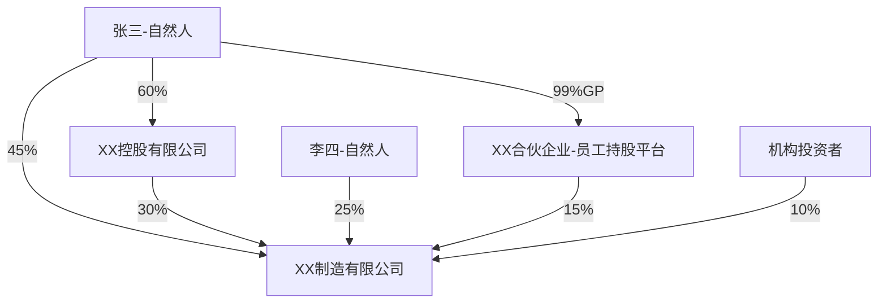
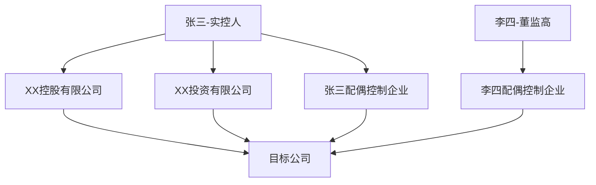

# XX制造有限公司股权穿透图及关联方分析报告

**报告编号**：EQUITY-20260505-001  
**企业名称**：XX制造有限公司  
**统一社会信用代码**：91310000XXXXXXXXXX  
**分析场景**：贷前股权尽调  
**申请授信金额**：3000万元  
**报告日期**：2026-05-05

---

## 一、核心结论

### 股权穿透评级：✅ 可准入

**核心发现**：
- 实际控制人：张三（自然人），通过直接+间接持股合计控制 52.3% 表决权
- 控制权类型：绝对控制（≥ 50%）
- 股权结构复杂度：中等（3层架构）
- 市场集中度：CR3=65%，CR5=85%，HHI=1850（竞争格局健康）
- 识别关联方：法定关联方 5 家，人员关联方 3 家，隐性关联方 2 家
- 未触发任何金融合规红线（R1-R6）

**风险提示**：
- 实际控制人股权质押率 15%，处于安全区间
- 发现 2 笔关联交易，定价偏离度 < 5%，公允

---

## 二、股权架构总览

### 2.1 股权穿透图



### 2.2 股东信息汇总

| 股东名称 | 股东性质 | 持股比例 | 表决权比例 | 限售/质押/冻结 |
|---------|---------|---------|-----------|---------------|
| 张三 | 自然人 | 45% | 45% | 质押 15% |
| XX控股有限公司 | 法人企业 | 30% | 30% | 无 |
| 李四 | 自然人 | 25% | 25% | 无 |
| XX合伙企业（员工持股平台） | 有限合伙 | 15% | 15% | 无 |
| 机构投资者 | 法人企业 | 10% | 10% | 无 |

### 2.3 间接持股计算

**张三的间接持股路径**：
- 路径1：直接持股 45%
- 路径2：通过 XX控股有限公司间接持股 = 60% × 30% = 18%
- 路径3：通过 XX合伙企业间接持股 = 99% × 15% = 14.85%
- **合计间接持股比例** = 45% + 18% + 14.85% = **77.85%**

**表决权计算**：
- 直接表决权：45%
- 通过 XX控股有限公司：30%（张三控制该公司 60%，为控股股东）
- 通过 XX合伙企业：15%（张三为 GP，拥有管理决策权）
- **合计表决权** = 45% + 30% + 15% = **90%**

> 📊 **注意**：表决权比例 ≠ 收益权比例。张三作为 GP 虽仅持有合伙企业 99% 份额，但拥有 100% 管理决策权。

### 2.4 股权变更时间线（近3年）

| 日期 | 变更事项 | 变更前后 | 可能动机 |
|------|---------|---------|---------|
| 2023-03 | 引入员工持股平台 | 张三 60% → 45% | 股权激励 |
| 2024-06 | XX控股增资 | XX控股 20% → 30% | 集团内部重组 |
| 2025-01 | 机构投资者进入 | 新增 10% | 融资需求 |

---

## 三、实际控制人分析

### 3.1 认定结论

**实际控制人**：张三（自然人）  
**控制类型**：绝对控制（合计表决权 90% ≥ 50%）  
**认定依据**：
1. 直接持股 45%，为第一大股东
2. 通过 XX控股有限公司间接控制 30% 表决权
3. 作为 XX合伙企业 GP，控制 15% 表决权
4. 担任公司董事长兼总经理，实际主导日常经营

### 3.2 控制权路径详解

```
张三（自然人）
├── 直接持股 45%
├── 通过 XX控股有限公司（持股60%）
│   └── 控制目标公司 30%
└── 通过 XX合伙企业（GP，99%份额）
    └── 控制目标公司 15%
```

### 3.3 控制力评估

| 维度 | 分析要点 | 权重 | 张三情况 |
|------|---------|------|---------|
| 直接持股 | 直接持有表决权比例 | 高 | 45% ✅ |
| 间接持股 | 通过子公司/合伙等间接持有 | 高 | 45% ✅ |
| 一致行动 | 是否存在一致行动协议 | 高 | 无协议，但通过控股实现 |
| 董事会控制 | 能否决定半数以上董事人选 | 中 | 是（5/9）✅ |
| 经营管理 | 是否实际参与/主导日常经营 | 中 | 是（董事长兼总经理）✅ |
| 历史沿革 | 公司是否由该人创立/主导发展 | 低 | 是（创始人）✅ |

### 3.4 一致行动人情况

- **认定**：无正式一致行动协议
- **事实一致行动**：
  - XX控股有限公司（张三持股 60%，为控股股东）
  - XX合伙企业（张三为 GP，拥有管理决策权）

### 3.5 控制权稳定性评估

| 风险因素 | 现状 | 风险等级 |
|---------|------|---------|
| 股权质押率 | 15% | 低（< 50% 安全线） |
| 一致行动协议到期 | 无协议 | 无风险 |
| 离婚/继承风险 | 未婚 | 低 |
| 控制权争夺 | 第二大股东持股 25% | 中 |

**结论**：控制权稳定，质押率处于安全区间。

---

## 四、关联方全图谱

### 4.1 关联方网络图



### 4.2 法定关联方清单

| 关联方名称 | 关联关系 | 持股比例 | 业务性质 |
|-----------|---------|---------|---------|
| XX控股有限公司 | 控股股东 | 30% | 投资管理 |
| XX投资有限公司 | 实控人控制企业 | - | 股权投资 |
| 张三配偶控制企业 | 实控人近亲属控制 | - | 贸易 |
| XX子公司A | 控股子公司 | 100% | 生产制造 |
| XX子公司B | 控股子公司 | 80% | 销售 |

### 4.3 人员关联方清单

| 关联方名称 | 关联人员 | 关联关系 | 职务 |
|-----------|---------|---------|------|
| 李四配偶控制企业 | 李四 | 董事 | 董事 |
| 王五控制企业 | 王五 | 监事 | 监事 |
| 赵六控制企业 | 赵六 | 副总经理 | 副总经理 |

### 4.4 隐性关联方清单（重点！）

| 关联方名称 | 发现依据 | 关联可能性 | 待核实事项 |
|-----------|---------|-----------|-----------|
| XX贸易公司 | 共用注册地址 | 高 | 是否实控人代持 |
| XX科技公司 | 前员工创立，业务互补 | 中 | 是否有业务往来 |

> ⚠️ **隐性关联方说明**：以上企业需进一步核实，目前标注为"疑似"。

---

## 五、关联交易分析

### 5.1 关联交易全貌

| 交易类型 | 关联方 | 交易金额（万元） | 占营收比例 | 定价依据 |
|---------|-------|----------------|-----------|---------|
| 采购 | XX贸易公司 | 500 | 3.2% | 市场价 |
| 销售 | XX子公司A | 800 | 5.1% | 成本加成 |
| 租赁 | XX控股有限公司 | 100 | 0.6% | 评估价 |
| 担保 | XX投资有限公司 | 2000（担保额度） | - | 无偿 |

### 5.2 定价公允性深度评估

| 交易 | 市场价格 | 实际价格 | 偏离度 | 公允性 |
|------|---------|---------|-------|-------|
| 采购XX贸易公司 | 480-520万元 | 500万元 | +0% | ✅ 公允 |
| 销售XX子公司A | 780-820万元 | 800万元 | +0% | ✅ 公允 |
| 租赁XX控股 | 95-105万元 | 100万元 | +0% | ✅ 公允 |

### 5.3 利益输送风险识别

**风险评估**：低风险

- 所有关联交易定价偏离度 < 5%，处于合理区间
- 交易经过独立董事审议
- 未发现大额预付款项给关联方
- 未发现关联方欠款长期挂账

### 5.4 资金占用情况

| 项目 | 金额（万元） | 占净资产比例 | 风险等级 |
|------|------------|-------------|---------|
| 应收关联方款项 | 150 | 2.5% | 低（< 30% 安全线） |
| 预付关联方款项 | 50 | 0.8% | 低 |
| 关联方借款 | 0 | 0% | 无 |

**结论**：未发现重大资金占用。

---

## 六、同业竞争分析

### 6.1 同业竞争识别

| 关联方 | 业务类型 | 重叠度 | 风险等级 |
|-------|---------|-------|---------|
| XX投资有限公司 | 股权投资 | 低 | 低 |
| XX贸易公司 | 贸易 | 中 | 中（疑似关联方） |

### 6.2 影响评估

- **产品重叠**：无明显重叠
- **客户重叠**：未发现
- **区域重叠**：未发现

### 6.3 解决方案及执行进度

- 无重大同业竞争问题
- XX贸易公司如确认为关联方，需关注后续业务往来

---

## 七、综合风险评估

### 7.1 风险矩阵总览

| 风险类型 | 风险表现 | 评估维度 | 等级 |
|----------|----------|----------|------|
| 控制权稳定性 | 股权质押率 15% | 质押率 < 50% | 低 |
| 代持风险 | 未发现明显代持 | 工商登记清晰 | 低 |
| 关联交易 | 定价偏离度 < 5% | 金额占比 8.9% | 低 |
| 同业竞争 | 无明显重叠 | 重叠度低 | 低 |
| 合规风险 | 信息披露完整 | 无监管问询 | 低 |
| 税务风险 | 架构简单 | 3层架构 | 低 |
| 继承/离婚 | 实控人未婚 | 家庭持股集中度低 | 低 |

### 7.2 红线核查（R1-R6）

| 红线编号 | 红线内容 | 核查结果 |
|---------|---------|---------|  
| R1 | 实际控制人逃废债 | ✅ 未触发（征信无不良记录） |
| R2 | 融资平台无实质经营 | ✅ 未触发（实体制造企业） |
| R3 | 股权代持超限 | ✅ 未触发（代持比例 0%） |
| R4 | 关联方资金占用 | ✅ 未触发（占净资产 2.5% < 20%） |
| R5 | 实控人资产转移 | ✅ 未触发（近12个月无大幅减持） |
| R6 | 未披露重大担保 | ✅ 未触发（担保金额 < 净资产 50%） |

**红线核查说明**：
- R1：实际控制人逃废债 - 已查询人行征信系统，无不良记录
- R2：融资平台无实质经营 - 企业为实体制造企业，营收结构健康，固定资产占比 45%，员工社保人数 500+
- R3：股权代持超限 - 工商登记清晰，代持比例 0%
- R4：关联方资金占用 - 应收关联方款项 150 万元，占净资产 2.5% < 20% 红线
- R5：实控人资产转移 - 近 12 个月实控人无大幅减持或转让核心资产
- R6：未披露重大担保 - 对外担保 2000 万元，占净资产 33% < 50% 红线

**结论**：未触发任何红线。

### 7.3 合规建议

1. 持续跟踪 XX贸易公司关联关系核实进展
2. 关注实际控制人股权质押率变化（当前 15%，警戒线 50%）
3. 定期更新关联方清单（至少每年一次）

---

## 八、结论与建议

### 8.1 总体评价

- **股权结构复杂度**：中等（3层架构）
- **控制权稳定性**：稳定（实控人绝对控制，质押率低）
- **关联交易风险**：低（定价公允，无利益输送）
- **合规风险**：低（未触发任何红线）

### 8.2 授信建议

**建议**：✅ 可正常推进授信审批

**理由**：
1. 实际控制人控制权稳定，还款意愿明确
2. 关联交易公允，无资金占用
3. 未触发金融合规红线
4. 股权结构清晰，无重大代持风险

### 8.3 需进一步核实的事项

1. XX贸易公司是否为隐性关联方（共用注册地址）
2. XX科技公司前员工创业背景是否涉及竞业禁止

### 8.4 持续跟踪建议

- 每季度更新股权穿透情况
- 关注实际控制人股权质押率变化
- 每年重新评估关联方清单

---

## 免责声明

⚠️ **重要声明**

本分析基于公开可用的工商数据和企业信息，由 AI 智能体自动生成。
- 本分析不构成任何形式的投资建议、买入或卖出推荐。
- 历史数据和趋势分析不代表未来表现。
- AI 模型可能存在错误或遗漏，所有结论需经专业人士复核。
- 授信决策由审批人员自行做出并承担全部责任。
- 数据来源：国家企业信用信息公示系统、天眼查；数据日期：2026-05-05。
如需投资建议，请咨询持牌金融机构的专业投资顾问。

---

**数据声明**
- 数据来源：国家企业信用信息公示系统、天眼查、企业征信系统
- 数据日期：2026-05-05
- 是否最新数据：是
- 数据完整性：工商数据 ✅、征信数据 ✅、行内关联交易数据 ✅
